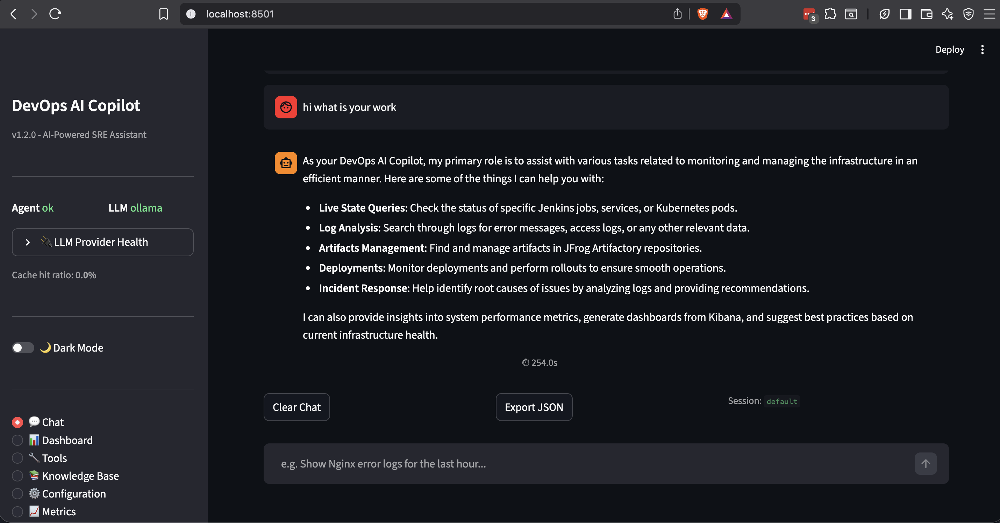

# DevOps AI Copilot

> AI-powered natural language interface for your entire DevOps infrastructure.
> Ask questions in plain English — get instant answers from Kubernetes, Jenkins, Kibana, Artifactory, Nginx, Prometheus, and more.


---

## What is this?

DevOps AI Copilot is a self-hosted AI assistant that runs **inside your Kubernetes cluster** (or locally via Docker Compose) and connects to your infrastructure tools. Powered by **Ollama** (local LLM — no data leaves your cluster), it understands natural language queries and translates them into targeted API calls across your entire stack.

Ask things like:

- `Show me Nginx 5xx errors from the last hour`
- `What pods are in CrashLoopBackOff in production?`
- `List failed Jenkins builds today`
- `Check SSL cert expiry for api.example.com`
- `What's the current on-call engineer?`
- `Show me CPU usage across all EC2 instances`

---

## Architecture

```
 +------------------+     +------------------+     +------------------+
 |  GUI Container   | --> |  Agent Container | --> | Ollama Container |
 |  Streamlit :8501 |     |  FastAPI  :8000  |     | Local LLM :11434|
 +------------------+     +--------+---------+     +------------------+
                                  |
          +--------------------+---+--------------------+--------------------+
          |         |          |          |         |                |
       Nginx    Kibana     Jenkins   Artifactory  K8s API     Prometheus
      (logs)   (alerts)    (jobs)    (artifacts) (pods/nodes)   (metrics)
```

**4 Containers:**
| Container | Image | Port | Role |
|-----------|-------|------|------|
| `agent` | `ghcr.io/whoismonesh/devops-ai-copilot/devops-ai-copilot-agent` | 8000 | FastAPI brain — orchestrates 17 tools across your infra |
| `gui` | `ghcr.io/whoismonesh/devops-ai-copilot/devops-ai-copilot-gui` | 8501 | Streamlit UI — chat, config, tools explorer, dashboard |
| `ollama-qwen` | `ghcr.io/whoismonesh/devops-ai-copilot/devops-ai-copilot-ollama-qwen` | 11434 | Ollama + Qwen2.5 3B (fast, lightweight) |
| `ollama-mistral` | `ghcr.io/whoismonesh/devops-ai-copilot/devops-ai-copilot-ollama-mistral` | 11434 | Ollama + Mistral 7B (higher quality, recommended) |

---

## Screenshots



---

## Supported Tools (17 tools across 14 integrations)

The agent auto-discovers all tools at startup. Each tool is a self-contained Python module. The LLM decides which tool to call based on your query.

### Kubernetes (`kubernetes_tool.py`)
Query your Kubernetes cluster directly — no `kubectl` needed.

- **`list_pods`** — List all pods in a namespace with status, restarts, node, and age
- **`get_pod_logs`** — Fetch logs from any pod (supports tail lines and timestamps)
- **`describe_pod`** — Full pod details including events, conditions, container status, and recent events
- **`get_deployments`** — List deployments with desired vs ready replica counts
- **`get_high_restart_pods`** — Find pods restarting above a threshold (default: 3) — great for incident triage

**Example queries:**
```
"Show me all pods in the production namespace"
"What pods are CrashLoopBackOff?"
"Get logs from the api-deployment-7f4b9c8d6-x2mzp pod"
"Find pods that have restarted more than 5 times"
```

### Jenkins (`jenkins_tool.py`)
Full CI/CD visibility and control.

- **`list_jenkins_jobs`** — List all jobs (including nested folder jobs) with last build status and color
- **`get_jenkins_build_status`** — Build result, duration, trigger cause, and link for any job/build number
- **`get_jenkins_build_log`** — Last 100 lines of console output for any build
- **`trigger_jenkins_build`** — Trigger a build with optional parameters (supports `folder/job-name` paths)
- **`get_jenkins_pipeline_stages`** — Pipeline stage breakdown with duration and status per stage

**Example queries:**
```
"List all failed Jenkins jobs today"
"Show the last build of deploy/api-service"
"Get the pipeline stages for the main branch build"
"Trigger a build of myapp with ENVIRONMENT=staging"
```

### Kibana / Elasticsearch (`kibana_tool.py`)
Search and analyze logs from your Elastic stack.

- **`search_error_logs`** — Find ERROR/WARN logs for a service within a time window (last N minutes)
- **`search_logs_by_query`** — Free-text Lucene query across any index pattern (e.g. `status:500 AND path:/api/login`)
- **`get_kibana_dashboards`** — List available dashboards by name filter
- **`get_log_count_by_level`** — Aggregation of log levels (ERROR/WARN/INFO) per service

**Example queries:**
```
"Show me error logs from nginx in the last 30 minutes"
"Search for 500 errors in the logs-* index from the past hour"
"What are the log levels for the auth-service?"
"Find all logs containing 'connection timeout' in the last 15 minutes"
```

### Nginx (`nginx_tool.py`)
Web server access and error log analysis.

- **`get_nginx_5xx_errors`** — All 5xx responses from access log within a time window, grouped by status code
- **`get_nginx_top_endpoints`** — Most requested URLs ranked by request count
- **`get_nginx_status_summary`** — HTTP status code distribution, error rate %, top client IPs
- **`get_nginx_error_log`** — Raw last N lines from the Nginx error log

**Example queries:**
```
"Show me all 5xx errors from Nginx in the last hour"
"What are the top 10 endpoints by request count?"
"Give me the error rate for the past 30 minutes"
"Show me the last 50 lines of the Nginx error log"
```

### Prometheus (`prometheus_tools.py`)
Query metrics directly using PromQL.

- **`prometheus_query_range`** — Execute a PromQL range query over a time duration (e.g. `rate(http_requests_total[5m])`)
- **`prometheus_query_instant`** — Instant query for current metric value
- **`prometheus_get_series`** — List all time series matching a label matcher
- **`prometheus_get_label_values`** — Get all unique values for a label (e.g. all `job` names)
- **`prometheus_alerts`** — Fetch active/pending/suppressed alerts from Alertmanager

**Example queries:**
```
"Show me CPU usage over the last 2 hours"
"What is the current memory usage of all pods?"
"List all alerts that are currently firing"
"Show the request rate for the api service"
```

### Grafana (`grafana_tool.py`)
Dashboard browsing and metric annotation analysis.

- **`grafana_list_dashboards`** — Browse all available dashboards by title
- **`grafana_get_dashboard`** — Fetch dashboard structure and panel list by UID
- **`grafana_query_panel`** — Execute a query directly from a specific panel
- **`grafana_list_alerts`** — List all Grafana-managed alerts across all folders
- **`grafana_alert_groups`** — Alert groups with detailed firing/pending/no-data state
- **`grafana_get_annotation`** — Fetch annotations (deployments, incidents) for a time range

**Example queries:**
```
"Show me available Grafana dashboards"
"List all firing Grafana alerts"
"What annotations exist between 9am and 11am today?"
```

### JFrog Artifactory (`artifactory_tool.py`)
Artifact repository management and build tracking.

- **`search_artifact`** — Search artifacts by name pattern across all or specific repos
- **`get_artifact_info`** — Full metadata: size, checksums (SHA256/MD5), creation date, download URL, custom properties
- **`list_repositories`** — Browse repos by type (local/remote/virtual/federated)
- **`get_latest_artifact_version`** — Find the highest semver version for Maven/Gradle artifacts
- **`get_build_info`** — CI build metadata linked to Artifactory (build number, VCS revision, duration, modules)

**Example queries:**
```
"Find the latest version of com.myorg/myapp in libs-release-local"
"Show me info for myapp-2.1.0.jar"
"Search for all artifacts matching 'frontend-*' in the prod repo"
```

### AWS EC2 / ELB / ASG (`aws_tool.py`)
AWS infrastructure visibility via boto3 (supports IRSA or explicit credentials).

- **`ec2_list_instances`** — List EC2 instances by state (running/stopped/terminated) with optional tag filters
- **`ec2_get_instance_status`** — Detailed instance info: type, AZ, VPC, subnet, AMI, launch time, IP addresses
- **`ec2_get_asg_status`** — Auto Scaling Group desired/min/max capacity and per-instance health
- **`elb_list_load_balancers`** — List ALB/NLB load balancers with type, scheme, AZ coverage
- **`elb_get_target_health`** — Per-target health state (healthy/unhealthy/draining) for a target group

**Example queries:**
```
"List all running EC2 instances in production"
"Show me the status of the web-server ASG"
"What are the unhealthy targets in the api target group?"
"List all ALBs with Environment=prod tag"
```

### Docker (`docker_tool.py`)
Docker daemon introspection (when agent runs on a Docker host).

- **`docker_list_containers`** — List running (or all) containers with ID, name, image, status, ports
- **`docker_container_logs`** — Fetch container logs with configurable tail lines
- **`docker_container_stats`** — Real-time CPU%, memory, network I/O, block I/O per container
- **`docker_image_list`** — List all local Docker images with size and tag
- **`docker_swarm_services`** — Docker Swarm service replicas and status
- **`docker_swarm_nodes`** — Swarm node availability and manager status
- **`docker_system_info`** — Docker disk usage (images/containers/volumes reclaimable) and server version

**Example queries:**
```
"List all running Docker containers"
"Show me the last 100 lines of logs from the nginx container"
"What are the CPU and memory stats for all containers?"
"List Docker Swarm services and their replica status"
```

### GitHub Actions & GitLab CI (`github_tool.py`)
CI/CD pipeline visibility across GitHub and GitLab.

- **`github_list_workflow_runs`** — Recent GitHub Actions runs for a workflow or all workflows
- **`github_get_workflow_run_status`** — Detailed run info including per-job status and conclusion
- **`github_list_pr_checks`** — All CI check statuses for a given Pull Request number
- **`github_get_repo_info`** — Repository metadata (stars, forks, language, open issues)
- **`gitlab_list_pipelines`** — List GitLab pipelines filtered by status (running/success/failed)
- **`gitlab_get_pipeline_status`** — Detailed pipeline with per-job status and stage

**Example queries:**
```
"Show me the last 5 runs of the CI workflow"
"What are the CI checks status for PR #42?"
"List all failed GitLab pipelines today"
```

### PagerDuty (`pagerduty_tool.py`)
Incident management and on-call routing.

- **`pd_list_incidents`** — List triggered/acknowledged/resolved incidents with urgency filter
- **`pd_get_incident_details`** — Full incident including timeline of status changes and assignments
- **`pd_manage_incident`** — Acknowledge or resolve an incident directly (with optional note)
- **`pd_list_alert_groups`** — Alert Intelligence groups (firing/suppressed counts)
- **`pd_get_oncall`** — Current on-call user per escalation policy

**Example queries:**
```
"Who is currently on-call?"
"List all triggered incidents"
"Show me details of incident PXYZ123"
"Acknowledge incident PXYZ123 with note 'investigating'"
```

### SSL / DNS / HTTP (`ssl_tool.py`)
Certificate monitoring, DNS resolution, and HTTP security header checks.

- **`ssl_check_host`** — SSL certificate info, expiry date, days remaining, status rating (OK/WARNING/CRITICAL/EXPIRED)
- **`ssl_batch_check`** — Batch check multiple hosts at once
- **`ssl_get_cert_chain`** — Full certificate chain details for a host
- **`dns_lookup`** — DNS A/AAAA/CNAME/MX/TXT/NS lookups
- **`http_headers_check`** — Check HTTP response headers and security headers (HSTS, CSP, X-Frame-Options, etc.)

**Example queries:**
```
"Check SSL expiry for api.example.com"
"Show me SSL status for all my production hosts"
"What are the DNS records for example.com?"
"Check security headers for https://myapp.example.com"
```

### Terraform (`terraform_tool.py`)
Infrastructure-as-Code plan, apply, and state queries.

- **`terraform_validate`** — Validate `.tf` files without applying
- **`terraform_plan`** — Generate execution plan (normal or destroy)
- **`terraform_apply`** — Apply with optional auto-approve
- **`terraform_destroy`** — Tear down all managed resources
- **`terraform_state_list`** — List all resources in state (with optional filter)
- **`terraform_output`** — Read `output` variable values
- **`terraform_show`** — Current state as JSON

**Example queries:**
```
"Is my Terraform configuration valid?"
"What changes will Terraform make?"
"Show me all resources in the Terraform state"
"What are the Terraform output values?"
```

---

## Features

- **17 tools** across 14 integrations — Kubernetes, Jenkins, Kibana, Nginx, Prometheus, Grafana, Artifactory, AWS EC2/ELB/ASG, Docker, GitHub, GitLab, PagerDuty, SSL/DNS, Terraform
- **Natural language queries** — ask questions in plain English, get structured answers
- **In-cluster deployment** — agent uses K8s ServiceAccount (no kubeconfig file needed)
- **Local AI** — Ollama runs inside your cluster, zero data leakage to external APIs
- **Hot-reload config** — change service URLs and credentials via GUI without restarting
- **Extensible** — add a new tool by dropping a Python file in `agent/tools/`
- **Streamlit GUI** with Chat, Configuration, Tools Explorer, and Dashboard pages
- **CI/CD with Trivy** — every push runs lint, tests, Docker build, and security scans
- **EKS/K8s ready** — full RBAC, ServiceAccount, PVC manifests included

---

## Security Scan

> Scanned with [Trivy](https://github.com/aquasecurity/trivy) on every push to `main`.

| Image | Critical | High | Medium | Low | Total |
|-------|----------|------|--------|-----|-------|
| `agent` | 0 | 0 | 3 | 75 | 78 |
| `gui` | 0 | 0 | 14 | 103 | 118 |
| `ollama-qwen` | 1 | 8 | 26 | 9 | 44 |
| `ollama-mistral` | 1 | 8 | 26 | 9 | 44 |

**Latest scan:** `d1100dbf5125` 2026-03-22 05:24 UTC

---

## Quick Start (Docker Compose)

```bash
# 1. Clone the repo
git clone https://github.com/WhoisMonesh/devops-ai-copilot.git
cd devops-ai-copilot

# 2. Copy and fill in your config
cp .env.example .env
# Edit .env with your service URLs and credentials

# 3. Start all 3 containers
docker compose -f deploy/docker-compose.yml up -d

# 4. Open the GUI
open http://localhost:8501

# 5. Ask a question
# e.g. "Show me pods in CrashLoopBackOff" or "List failed Jenkins jobs today"
```

---

## Deploy to Kubernetes / EKS

```bash
# 1. Create namespace + RBAC + secrets
kubectl apply -f deploy/k8s/secrets.yaml

# 2. Edit secrets.yaml with your base64-encoded credentials
# kubectl create secret generic devops-copilot-secrets \
#   --from-env-file=.env -n devops-copilot

# 3. Apply ConfigMap
kubectl apply -f deploy/k8s/configmap.yaml

# 4. Deploy Ollama (local AI) + PVC
kubectl apply -f deploy/k8s/ollama-deployment.yaml

# 5. Deploy Agent
kubectl apply -f deploy/k8s/agent-deployment.yaml

# 6. Deploy GUI
kubectl apply -f deploy/k8s/gui-deployment.yaml

# 7. Check status
kubectl get pods -n devops-copilot
```

---

## Configuration

All configuration is available via:
1. **GUI** — open `http://<node-ip>:8501` → Configuration page → Save (hot-reload)
2. **Environment variables** — see `.env.example` for all options
3. **K8s ConfigMap** — edit `deploy/k8s/configmap.yaml`

### Infrastructure URLs

| Variable | Example | Description |
|----------|---------|-------------|
| `K8S_IN_CLUSTER` | `true` | Use in-cluster ServiceAccount (no kubeconfig needed) |
| `K8S_NAMESPACE` | `production` | Default namespace for queries |
| `OLLAMA_BASE_URL` | `http://ollama:11434` | Ollama service URL |
| `OLLAMA_MODEL` | `qwen2.5:3b` | Model to use (qwen2.5:3b, mistral, llama3.2, etc.) |
| `JENKINS_URL` | `https://jenkins.internal.io` | Jenkins URL |
| `KIBANA_URL` | `https://kibana.internal.io` | Kibana URL |
| `ELASTICSEARCH_URL` | `https://elasticsearch.internal.io` | Elasticsearch URL |
| `ARTIFACTORY_URL` | `https://artifactory.internal.io` | JFrog Artifactory URL |
| `NGINX_ACCESS_LOG` | `/var/log/nginx/access.log` | Path to Nginx access log |
| `NGINX_ERROR_LOG` | `/var/log/nginx/error.log` | Path to Nginx error log |
| `PROMETHEUS_URL` | `http://prometheus.monitoring:9090` | Prometheus URL |
| `GRAFANA_URL` | `https://grafana.internal.io` | Grafana URL |
| `GRAFANA_API_KEY` | `glp_xxxxx` | Grafana API key (for dashboard/alert access) |
| `AWS_REGION` | `us-east-1` | AWS region |
| `PAGERDUTY_TOKEN` | `xxxxx` | PagerDuty API token |
| `GITHUB_TOKEN` | `ghp_xxxxx` | GitHub personal access token |
| `GITHUB_REPO` | `owner/project` | GitHub repo for CI visibility |
| `GITLAB_URL` | `https://gitlab.com` | GitLab instance URL |
| `GITLAB_TOKEN` | `xxxxx` | GitLab API token |
| `GITLAB_PROJECT_ID` | `12345` | GitLab project ID |

### Secrets (via AWS Secrets Manager)

Point to AWS Secrets Manager secret IDs for credentials:

| Variable | Description |
|----------|-------------|
| `SECRET_ID_JENKINS` | AWS Secrets Manager secret containing `username` + `api_token` |
| `SECRET_ID_ARTIFACTORY` | AWS Secrets Manager secret containing `username` + `api_key` |
| `SECRET_ID_KIBANA` | AWS Secrets Manager secret containing `username` + `password` |
| `AWS_ACCESS_KEY_ID` | AWS access key (for EC2/ELB/ASG tools) |
| `AWS_SECRET_ACCESS_KEY` | AWS secret key |

---

## Project Structure

```
devops-ai-copilot/
├── agent/
│   ├── main.py                  # FastAPI entry point (/query, /health, /config, /tools)
│   ├── orchestrator.py          # LLM + tool orchestration engine
│   ├── ollama_client.py         # Ollama HTTP client + model management
│   ├── config.py                # Central config with hot-reload support
│   ├── secrets.py               # AWS Secrets Manager integration
│   ├── requirements.txt
│   └── tools/
│       ├── __init__.py          # Auto-discovers all tools
│       ├── base.py              # BaseTool abstract class
│       ├── kubernetes_tool.py    # K8s pods, logs, deployments, restarts
│       ├── jenkins_tool.py       # Jenkins jobs, builds, logs, triggers
│       ├── kibana_tool.py        # Elasticsearch logs, dashboards, aggregations
│       ├── artifactory_tool.py   # Artifact search, repos, build info
│       ├── nginx_tool.py         # Nginx access/error logs, 5xx, top endpoints
│       ├── prometheus_tools.py   # PromQL queries, alerts, label values
│       ├── grafana_tool.py       # Dashboards, panels, alerts, annotations
│       ├── jenkins_tools.py       # Alias for jenkins_tool
│       ├── aws_tool.py           # EC2, ELB, Auto Scaling Groups
│       ├── docker_tool.py        # Docker containers, logs, stats, Swarm
│       ├── github_tool.py        # GitHub Actions, PR checks, repo info
│       ├── gitlab_tool.py        # (via github_tool) GitLab pipelines
│       ├── pagerduty_tool.py    # Incidents, on-call, alert groups
│       ├── ssl_tool.py           # SSL cert expiry, DNS, HTTP headers
│       ├── terraform_tool.py     # Terraform plan/apply/state/output
│       ├── cloudwatch_tool.py    # AWS CloudWatch logs
│       ├── database_tool.py      # Database connectivity checks
│       ├── knowledge_base_tool.py # Internal KB/search
│       └── llm_tools.py          # LLM interaction utilities
├── gui/
│   ├── app.py                   # Streamlit app (Chat, Config, Tools, Dashboard)
│   ├── requirements.txt
│   └── Dockerfile
├── deploy/
│   ├── Dockerfile.agent          # Multi-stage Python/uvicorn agent container
│   ├── Dockerfile.ollama         # Ollama container with pre-pulled model
│   ├── docker-compose.yml         # Local 3-container dev stack
│   └── k8s/
│       ├── secrets.yaml          # RBAC + ServiceAccount + Secrets template
│       ├── configmap.yaml        # Non-sensitive configuration
│       ├── agent-deployment.yaml
│       ├── gui-deployment.yaml
│       └── ollama-deployment.yaml  # Ollama + PVC (GPU-ready)
├── scripts/
│   ├── generate_trivy_summary.py  # Generates plain-text scan summary
│   ├── generate_security_report.py # Generates combined .md and .json report
│   ├── generate_job_summary.py     # Generates GitHub Actions job summary
│   └── update_readme_security.py   # Patches README with scan results
├── tests/
│   ├── test_cache.py
│   ├── test_permissions.py
│   ├── test_llm_client.py
│   ├── test_circuit_breaker.py
│   └── ...
├── .github/workflows/
│   └── ci.yml                   # Lint → Test → Build → Push → Trivy scan → Publish report
├── .env.example
├── Makefile
└── README.md
```

---

## Development

```bash
# Install dependencies
make install

# Run agent locally (needs Ollama running)
make dev

# Run GUI locally
make gui

# Build Docker images
make docker-build

# Full stack with Docker Compose
make docker-up

# Lint
make lint

# Tests
make test
```

---

## Adding a New Tool

Create `agent/tools/mytool_tool.py`:

```python
from langchain.tools import tool

@tool
def mytool_query(query: str) -> str:
    """Describe what this tool does and what args it accepts.
    Args:
      query - description of the query parameter"""
    # Your logic here
    result = do_something(query)
    return result
```

Then add it to the tool registry in `agent/tools/__init__.py` or wherever tools are registered. The tool is auto-discovered on startup and the LLM will use it when your query matches its description.

**Best practices for tool descriptions:**
- Be specific about what the tool returns
- Mention the service it integrates with
- Use concrete examples in the description
- The LLM reads the `Args:` section to understand parameters

---

## License

MIT - see [LICENSE](LICENSE)
